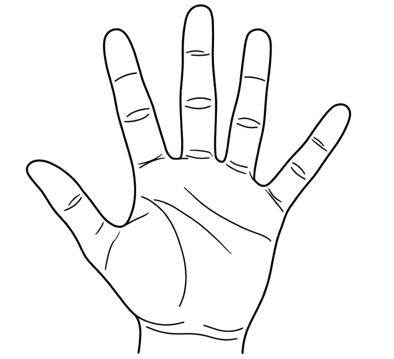
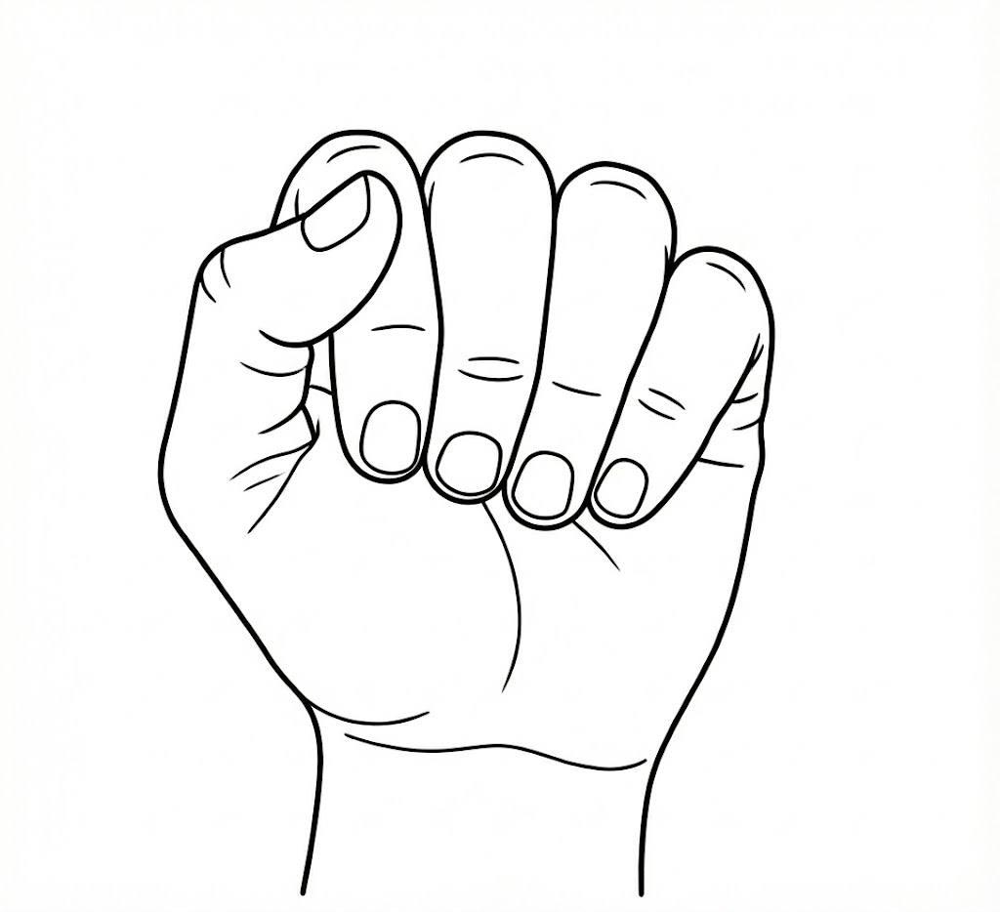
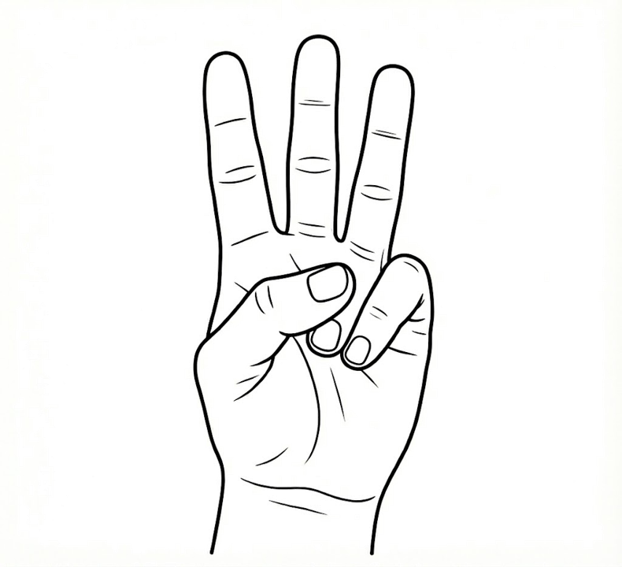
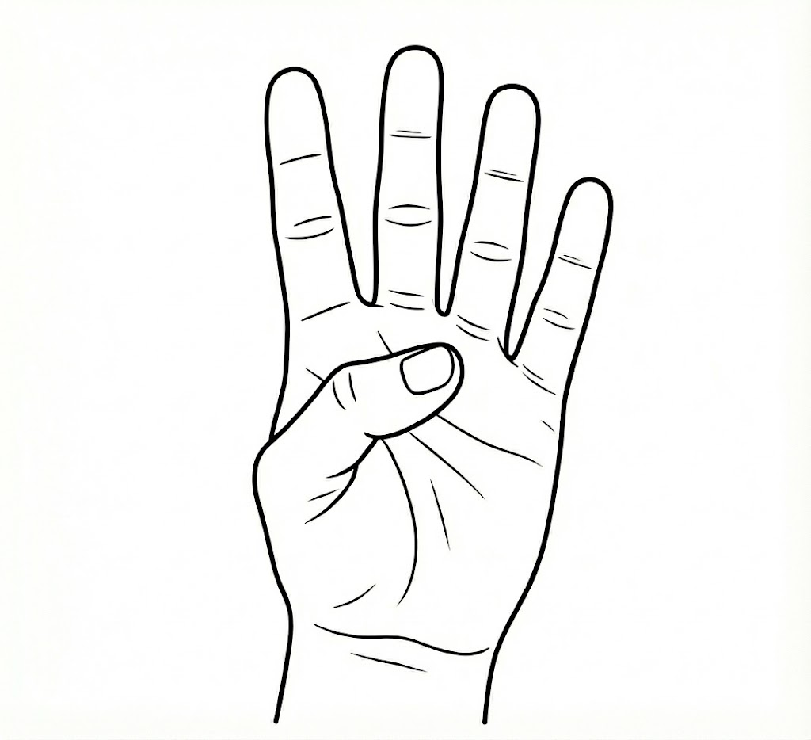

<h1 align="center">Touchless HCI for Media Control at the Edge</h1>

<p align="center">
  <b>Submission for the Bharat AI-SoC Student Challenge (Problem Statement 2)</b><br>
  <i>Organized by Arm, MeitY, and IIT Delhi</i>
</p>

<p align="center">
  
  
  
  
</p>

<div align="center">
  
  **[Watch the Demo Video on YouTube](https://youtu.be/Ef1OlU0tr-A)** &nbsp;&nbsp;•&nbsp;&nbsp; **[Read the Full Project Report Here](./TOUCHLESS%20HCI%20-%20Report%20-%20Bharat%20AI%20SoC.pdf)**

</div>

---

## Team Details
* **Team Members:** Abdullah Ajmal, Anuj Deep, Ayman Abdul Jaleel
* **Faculty Mentor:** Dr. Basant Kumar
* **Institution:** Motilal Nehru National Institute of Technology (MNNIT) Allahabad

---

## Project Overview
The objective of this project is to deliver a reliable, self-contained touchless system for media control that runs entirely on the edge. Traditional vision pipelines can cause high latency on edge devices, so we targeted the NVIDIA Jetson TX2 and optimized both hardware and software. By tailoring the workload to the TX2’s ARM Cortex‑A57 cores, using asynchronous camera threads, and adding a custom scale‑invariant heuristic, the system recognizes spatial hand gestures instantly and processes everything locally.

## Repository Files
* **[`jetson_vf.py`](./jetson_vf.py):** Main Python script for the gesture recognition pipeline.
* **[`plot_results.py`](./plot_results.py):** Generates performance graphs from the CSV log.
* **[`jetson_performance_data.csv`](./jetson_performance_data.csv):** Raw 8,000-frame log of FPS and latency.
* **[`run_demo.sh`](./run_demo.sh):** Automated deployment script for hardware and software initialization.

## Performance Metrics
Based on an 8,000-frame continuous stress test:
* **Processing Speed:** 46.6 FPS *(Target requirement: >15 FPS)*
* **AI Inference Latency:** 14.7 ms *(Target requirement: <200 ms)*
* **Collision Rate:** 0% false-positive triggers via state-based temporal filtering

## Hardware & Software Stack
* **Hardware:** NVIDIA Jetson TX2 Developer Kit, Standard USB 2.0 Webcam
* **Core Logic:** Python 3, OpenCV, Google MediaPipe (Lite Model)
* **Media Player:** `mpv` (stable X11 rendering)
* **System Integration:** Linux `xdotool` and Bash scripting

## Defined Gesture Set

| Action | Gesture | Type | Illustration |
| :--- | :--- | :--- | :--- |
| **Play / Pause** | Open Palm (5 Fingers) | Single Trigger |  |
| **Mute / Unmute** | Closed Fist (0 Fingers) | Single Trigger |  |
| **Volume Up** | Index Finger Up (1 Finger) | Continuous |  |
| **Volume Down** | Peace Sign (2 Fingers) | Continuous |  |
| **Seek Forward** | Three Fingers Up | Continuous |  |
| **Seek Backward** | Four Fingers Up | Continuous |  |

---

## Repository Guide & Deployment Instructions

Follow these steps to deploy the system natively on an NVIDIA Jetson TX2 running JetPack OS.

## Clone the Repository
```bash
git clone [https://github.com/AbdullahDxB/Bharat-AI-SoC-Touchless-HCI.git](https://github.com/AbdullahDxB/Bharat-AI-SoC-Touchless-HCI.git)
cd Bharat-AI-SoC-Touchless-HCI
```
## Install System Dependencies

```bash
sudo apt-get update
sudo apt-get install -y mpv xdotool
```
## Execute the Bash Script

```bash
chmod +x run_demo.sh
./run_demo.sh
```
